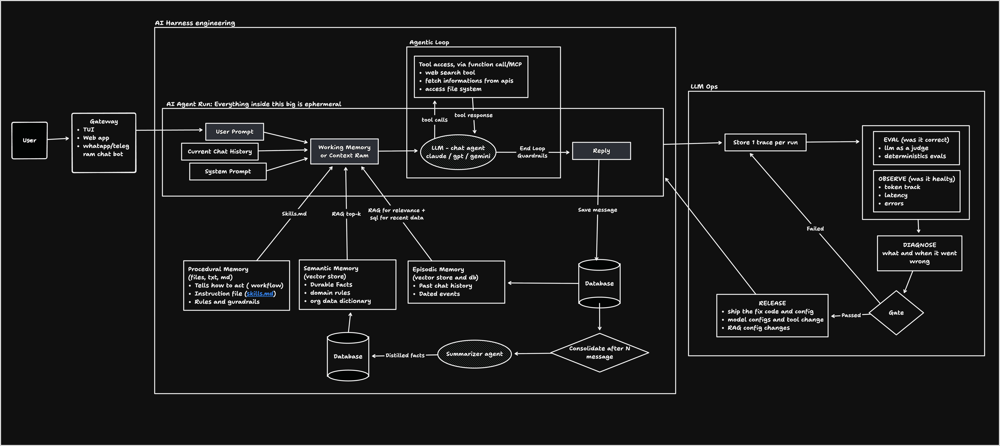
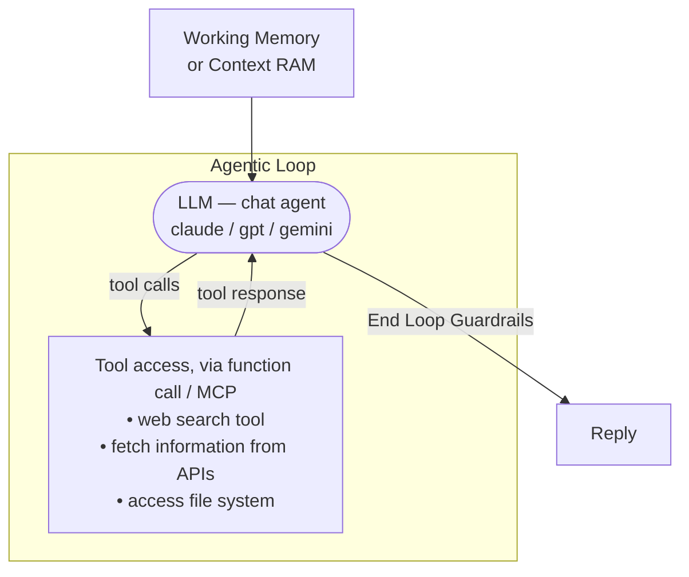
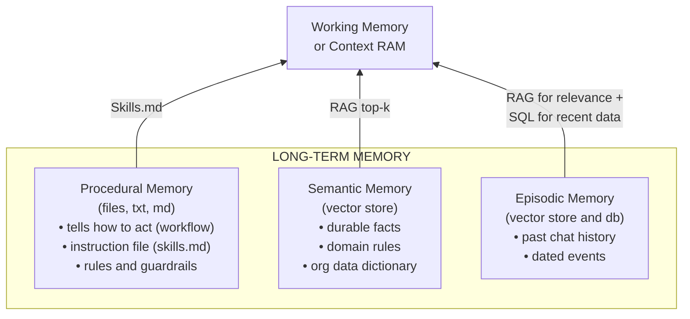
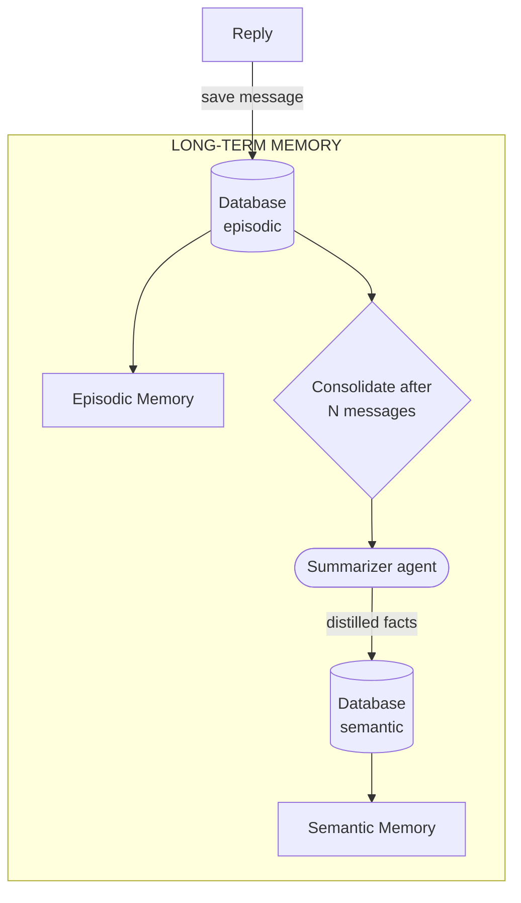
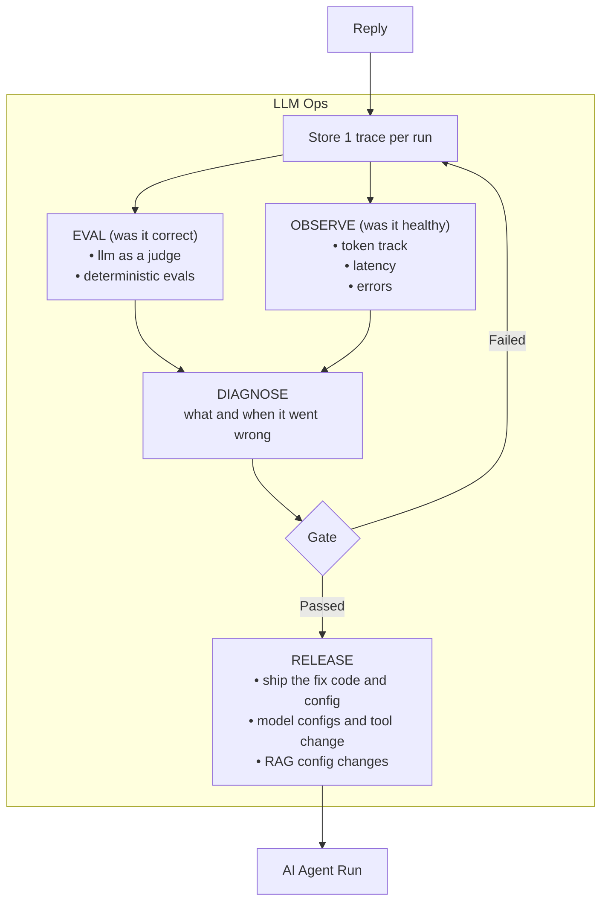

# Mini-Agent Architecture

Three layers:

- **Gateway** — how a user reaches the agent: TUI, web app, WhatsApp/Telegram chat bot.
- **AI Harness engineering** — runtime that assembles context, runs the agentic loop, calls tools, persists memory.
- **LLM Ops** — offline loop that traces, evaluates, diagnoses, gates, and releases fixes back into the harness.

---

## 1. Whole System

User enters through the gateway. Inside the harness the run flows left-to-right
(inputs -> working memory -> LLM -> reply), the agentic loop sits on top of it, and the
memory layer sits underneath with its databases and the consolidation path at the bottom.
Every reply also leaves the harness as a trace into LLM Ops, which feeds fixes back in.

---

## 2. Gateway

The only entry point. Same agent behind every surface:

- TUI
- Web app
- WhatsApp / Telegram chat bot

The gateway hands the user's message to the agent run as the **User Prompt**.

---

## 3. Harness

Everything inside the **AI Agent Run** box is **ephemeral** — it lives for one run and is discarded. Anything that must survive has to be written to a memory store.

### 3.1 Inputs -> Working Memory

Three sources assembled into **Working Memory / Context RAM** — the prompt actually sent to the model:

| Input | Source | Notes |
|---|---|---|
| User Prompt | Gateway | Current turn. |
| Current Chat History | Run state | Messages so far this conversation. |
| System Prompt | Config | Versioned artifact; updated by the Ops release step. |

Working memory is also enriched from the three long-term stores (§3.3).

### 3.2 The Agentic Loop

- **LLM — chat agent** — Claude, GPT, or Gemini class model. Each iteration: call a tool, or answer.
- **Tool access** — exposed via function calling or MCP: web search, fetching information from APIs, file system access. Tool responses re-enter the loop as new context.
- **End Loop Guardrails** — termination conditions: max iterations, token/cost budget, output validation, safety checks. Without them the loop can spin forever.
- **Reply** — goes to the user, **and** is saved to the episodic database, **and** is stored as a trace in LLM Ops.

### 3.3 Memory Types

Three stores, each with its own retrieval mechanism.

Episodic is the only one needing **both** a vector store and a DB: relevance alone is not enough when "what did we discuss last Tuesday" is a recency question — that part is a SQL query.

### 3.4 Memory Consolidation

Episodic memory grows every run; semantic memory should not.

1. Every reply is saved to the episodic database.
2. Gate batches the work — consolidate only after **N messages**, not per turn. Keeps cost bounded.
3. Summarizer agent compresses the raw messages; this is compression, not reasoning, so a cheaper model fits.
4. **Distilled facts** are written to the semantic database and become semantic memory.

Net: episodic = append-only log. Semantic = curated, deduplicated derivative.

---

## 4. LLM Ops

Fed by every run's reply.

### 4.1 Trace

**Store one trace per run.** The trace is the unit of analysis: prompt, retrieved context, each loop iteration, tool calls, final reply.

### 4.2 Two Independent Questions

| | Question | Method | Signal |
|---|---|---|---|
| **EVAL** | Was it correct? | LLM-as-a-judge + deterministic evals | Quality scores |
| **OBSERVE** | Was it healthy? | Instrumentation | Token track, latency, errors |

Independent failure modes. A run can be fast, cheap, error-free — and wrong. Or correct and unaffordable.

Deterministic evals sit next to the judge on purpose: exact-match, schema, and regression checks are cheap and stable, and the judge covers what they cannot express.

### 4.3 Diagnose -> Gate

- **DIAGNOSE** — what and when it went wrong. Localize to a stage: retrieval, prompt, tool, model config.
- **Gate** — decision on eval result.
  - **Failed** -> back to trace: fix, re-run, re-trace, re-eval.
  - **Passed** -> Release.

### 4.4 Release

What ships:

- fix code and config
- model configs and tool changes
- RAG config changes

Released changes feed back into the agent run. Closes the outer loop.

---

## 5. Three Loops, Three Timescales

| | Inner | Consolidation | Outer |
|---|---|---|---|
| Where | Inside a run | Across N messages | Across runs |
| Iterates on | Tool calls | Episodic -> semantic | Code, prompt, config |
| Terminated by | End loop guardrails | N-message gate | Gate (passed) |
| Timescale | Seconds | Hours | Hours to days |
| State | Ephemeral | Durable | Versioned + released |
